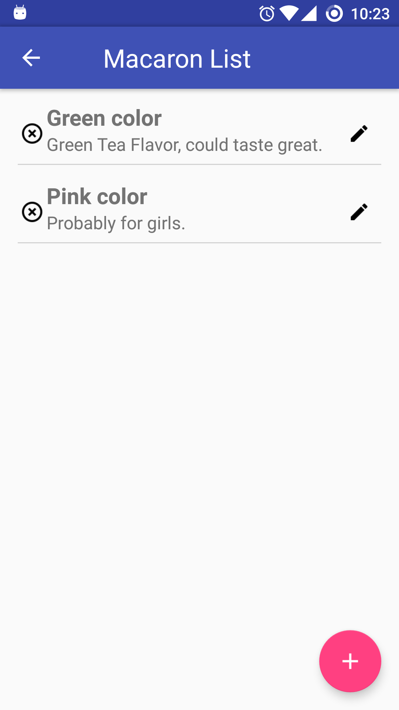
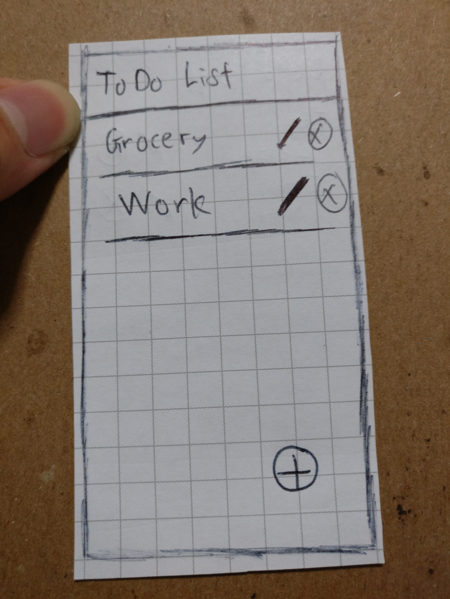
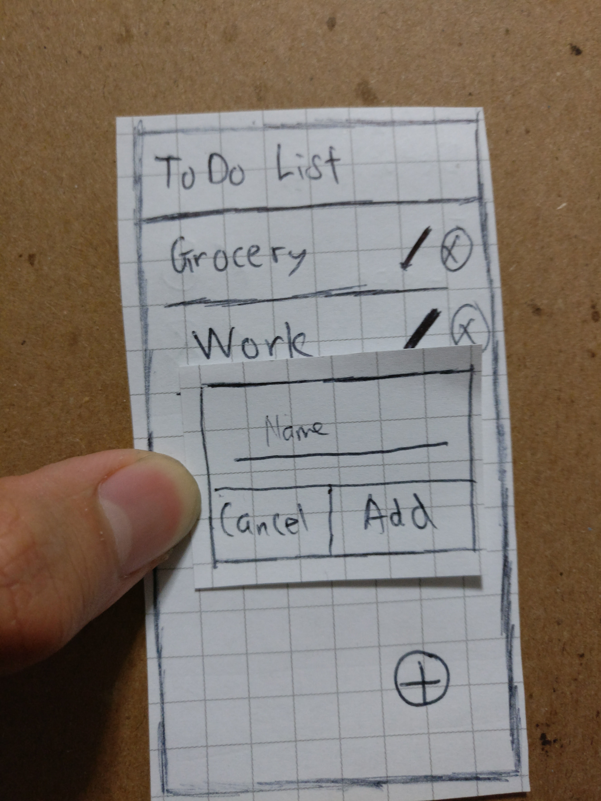
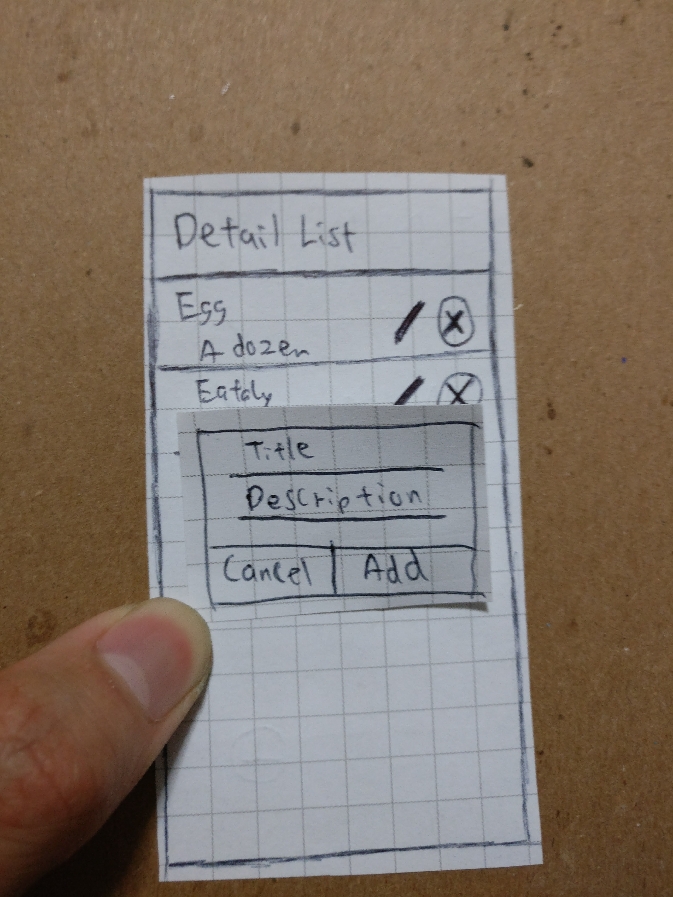
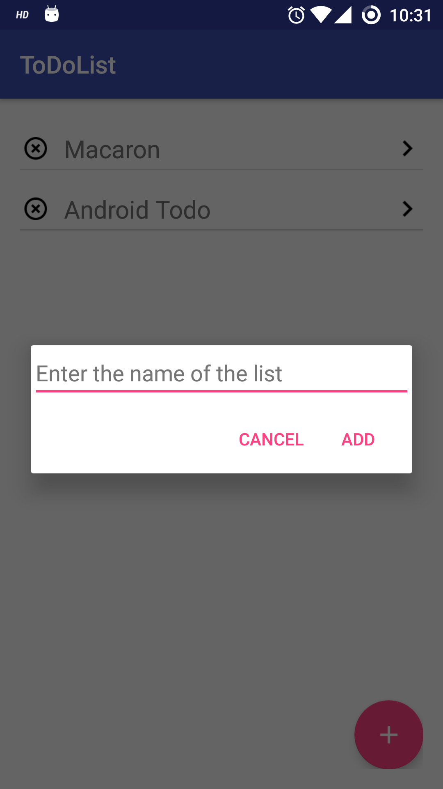
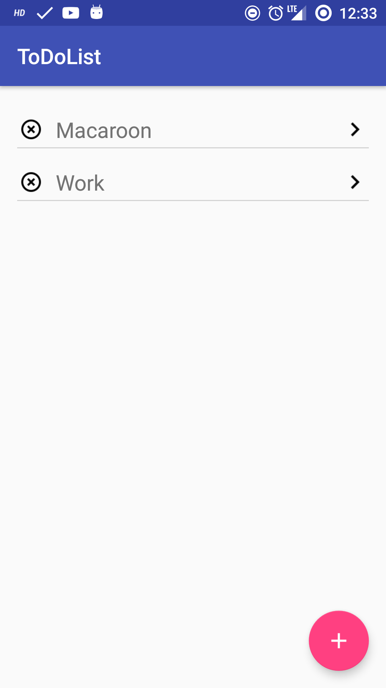
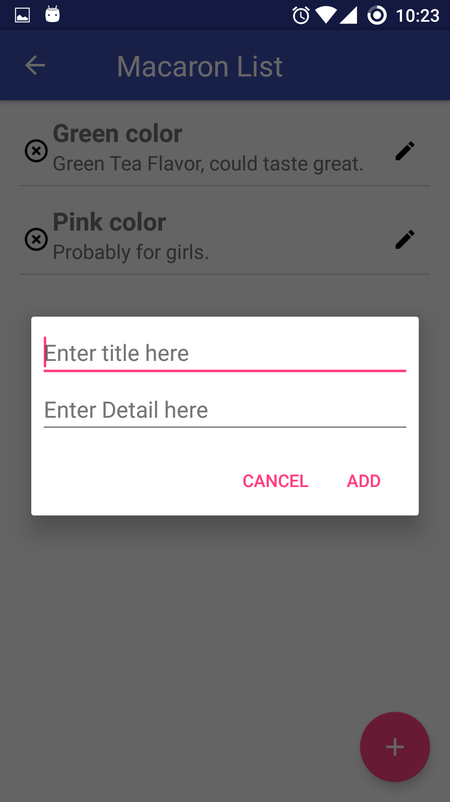
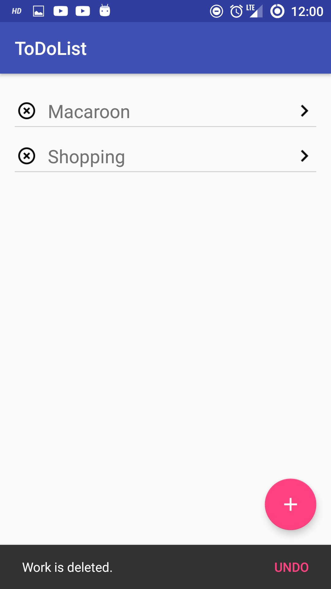
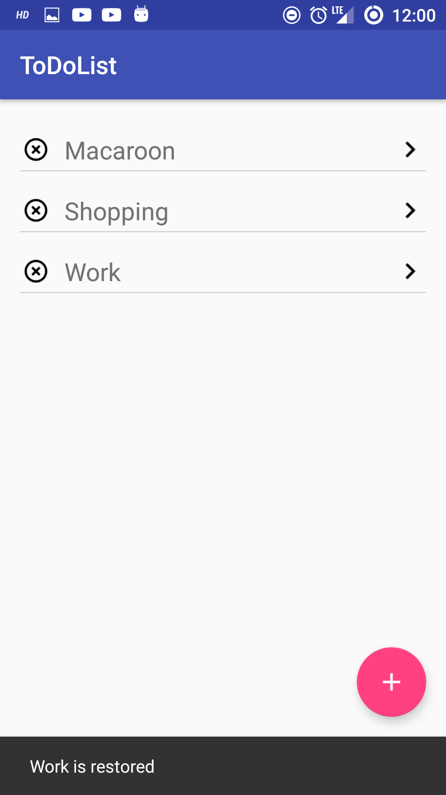
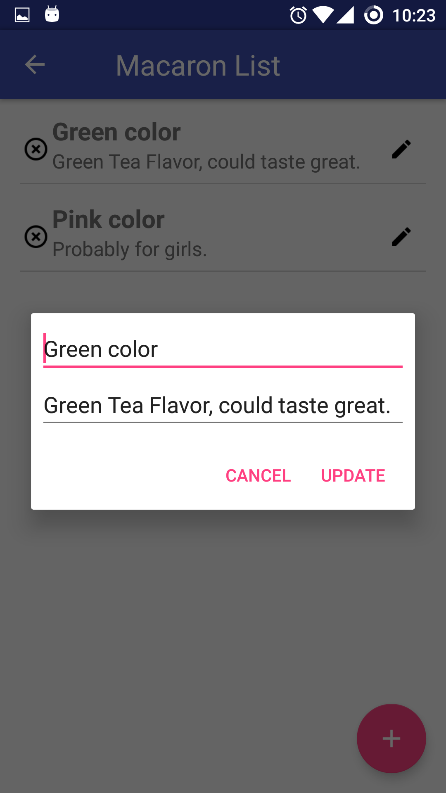

#Welcome to Project 1 - Macaron TodoList

Hello and welcome to my Macaron TodoList. This TodoList was designed with simplicity in use and have clean interface.
You can download my app here -> [Macaron TodoList] (https://play.google.com/store/apps/details?id=com.joelimyx.todolist&hl=en)

##Prototype 
Before I started anything, I drew some prototype as to how my Todo List would work before I started coding. Initially I was thinking of putting all the button on one side. But after a few testing with different layout, I ultimately  did change up some design aspect when I was doing the actual testing. 

  
  
  
  
  

##Functions
###Add List
You can **create** new List and add item to them individually!

###Remove
If you don't want to deal with your ToDo List, you can just **remove** it!

###Restore
Oops, accidentaly delete a list or item? You can **restore** it! If you can press the button in time.

###Rename 
Wrote the wrong title or missed some detial in your item? You can **Edit** them!

###Title or Name won't be empty
Want to make the list name or title empty? WELP sorry, I made it to not add on if **EMPTY**.

###Mark Done
Finally got your item or got it done? You can **mark it as done** by just pressing on the item.

##Not included / statisfied
###Data persistence 
I couldn't get the app to store data. I've tried shared preference, but the object just would not store the data.

###Detail and title alignment 
The title looks offset when the detail text is empty

###Button alignment 
This is still a work in progress. Things aren't exactly in position or seems offset.
